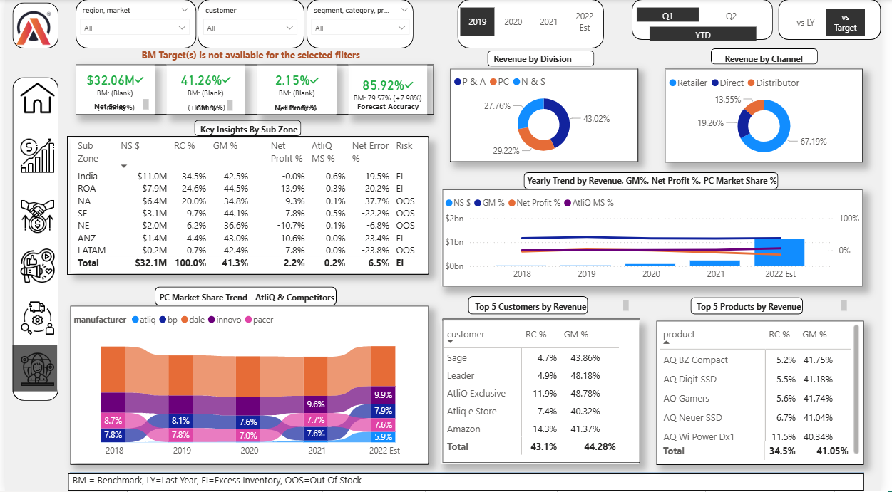

# 📊 Power BI Business Insights Dashboard

Welcome to my **Power BI Business Insights Project**, built as part of the **Codebasics Power BI course** by Dhaval Patel.  
This project provides a comprehensive analysis of **Sales**, **Marketing**, **Finance**, **Profit & Loss**, and **Supply Chain** performance across multiple dimensions.

---

## 🏠 Home Page

The **Home page** serves as the main navigation hub, allowing users to easily switch between different report sections using interactive buttons and bookmarks.

---

## 🧾 Finance

The **Finance dashboard** summarizes key financial KPIs including:
- Revenue trends  
- Expense breakdown  
- Gross Margin % and YoY comparisons  
- COGS (Cost of Goods Sold) and operational efficiency  

---

## 📈 Sales

The **Sales report** dives deep into sales performance by:
- Country, region, and product  
- Customer segmentation and contribution analysis  
- Top-performing and underperforming products  
- YoY growth and target achievements  

---

## 📢 Marketing

The **Marketing dashboard** provides insight into campaign effectiveness and customer engagement metrics.  
It includes:
- Campaign performance analysis  
- ROI tracking  
- Market share visualization  
- Trends in post-discount sales  

---

## 🚚 Supply Chain

The **Supply Chain dashboard** tracks the efficiency of operations, including:
- Inventory levels  
- Order fulfillment rates  
- Delivery performance metrics  
- Supplier contribution and cost impact  

---
# 🧭 Executive Dashboard - Power BI Project

This **Executive Dashboard** is the central view of my Power BI Business Insights project, created as part of the **Codebasics Power BI Course** by Dhaval Patel.

### 📊 Overview
The dashboard provides a **comprehensive summary** of business performance across all key areas:
- 💰 **Net Sales:** $3.74B  
- 📈 **Gross Margin:** 38.08%  
- 📉 **Net Profit:** -13.98%  
- 🎯 **Forecast Accuracy:** 81.17%

### 🔍 Key Insights
- Performance breakdown by **Region**, **Division**, and **Channel**  
- **Yearly trends** in Revenue, GM%, Net Profit%, and Market Share  
- **Top 5 Customers** and **Top 5 Products** by revenue  
- **Competitive Benchmarking** (AtliQ vs Competitors)

### ⚙️ Tools Used
- Power BI Desktop  
- SQL | Excel | DAX | DAX Studio  
----

### 📈 Summary Insight
This Executive Dashboard delivers a **clear, data-driven overview** for decision-makers — combining visuals, KPIs, and business metrics into one unified report.

## 🧠 Tools & Technologies Used
- **Power BI Desktop**
- **SQL**
- **Excel**
- **DAX Language**
- **DAX Studio** (for report optimization)
- **Power BI Service** (for publishing and data refresh setup)

---

## 🧩 Business Concepts Applied
- Gross Margin (GM%)
- Cost of Goods Sold (COGS)
- Net Profit
- Year-to-Date (YTD) and Year-to-Go (YTG)
- Discount Analysis (Pre- and Post-Invoice)
- Performance Benchmarking

---

## 🚀 Key Learnings
- End-to-end dashboard creation and data modeling  
- Dynamic filtering and interactivity through bookmarks and buttons  
- Data validation and optimization using DAX Studio  
- Business decision-making through data visualization  

---

## 🏁 Conclusion
This project strengthened my understanding of **data storytelling** and **business intelligence**.  
It demonstrates how **Power BI** can transform raw business data into actionable insights that drive decision-making across departments.

---

---

⭐ **If you found this project helpful, don’t forget  to star the repo!**
